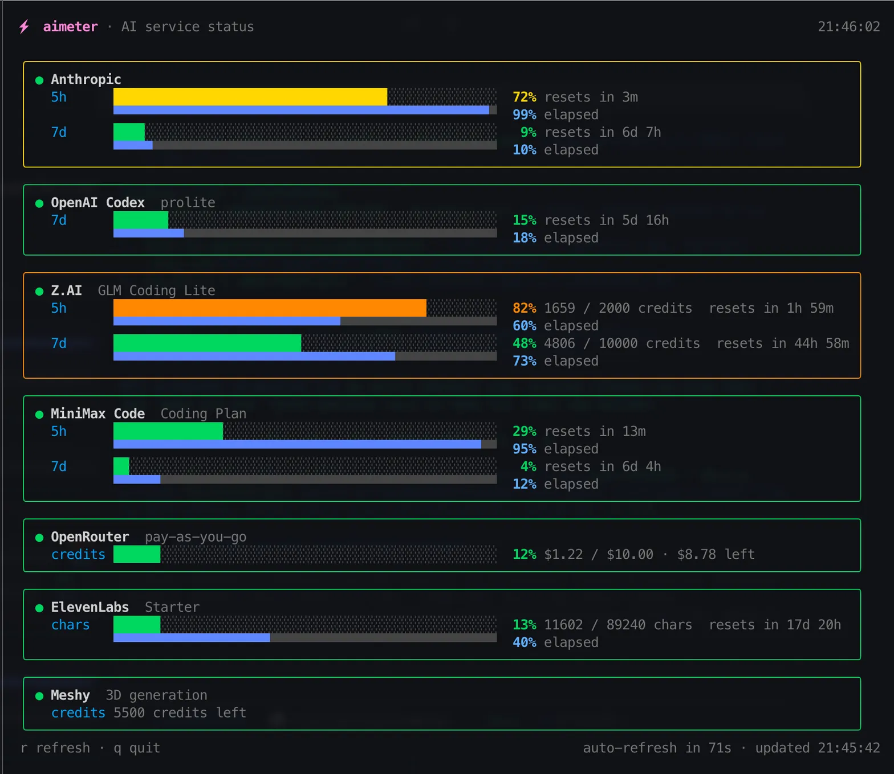
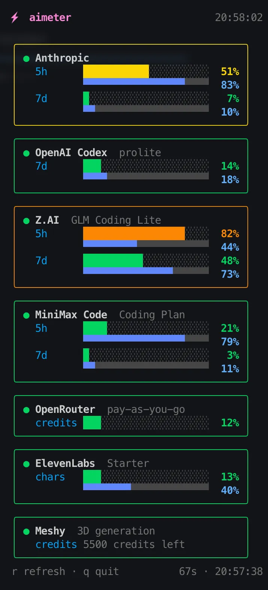

# aimeter

[](https://github.com/cookiebinary1/aimeter/actions/workflows/ci.yml)
[](https://pkg.go.dev/github.com/cookiebinary1/aimeter)
[](LICENSE)

TUI dashboard that surfaces API usage and quota gauges for a stack of AI
providers in one terminal view. Single static binary, no cgo, no runtime
dependencies.



## What it shows

Per-provider panels with current utilization, quota windows, and time-until-reset
for:

- Anthropic
- Codex
- Z.ai
- MiniMax
- OpenRouter
- ElevenLabs
- Meshy

Refresh interval is 90 seconds.

## Stack

- Go 1.25 (module `github.com/cookiebinary1/aimeter`)
- [Bubble Tea](https://github.com/charmbracelet/bubbletea) — TUI runtime
- [Lip Gloss](https://github.com/charmbracelet/lipgloss) — styling
- [modernc.org/sqlite](https://pkg.go.dev/modernc.org/sqlite) — pure-Go SQLite
  reader for the OMP credentials database

## Install

```sh
brew install cookiebinary1/tap/aimeter
# or, with a Go toolchain:
go install github.com/cookiebinary1/aimeter@latest
```

Or build from a checkout:

```sh
git clone https://github.com/cookiebinary1/aimeter
cd aimeter
go build -o ~/.local/bin/aimeter .
```

Builds and runs on macOS, Linux and Windows (amd64 and arm64).

The TUI is width-aware: on narrow terminals it drops the grey detail/reset
captions and grows the bars to fill the row instead of wrapping, so the panels
stay readable instead of spilling over.



### Usage

```sh
aimeter              # TUI dashboard (q quit, r refresh, auto-refresh 90s)
aimeter -once        # render the dashboard once, no TUI
aimeter -plain       # one " | "-separated line per gauge — for bash scripts
aimeter -json        # machine-readable JSON — for scripts and AI agents
aimeter -show-creds  # which source each credential resolved from
```

`-plain` example line:

```text
Z.AI | GLM Coding Lite | 5h | 60% | 1207 / 2000 credits | resets in 3h 53m
```

`-json` gauge fields: `label`, `used` (0-100, or -1 for balance-only),
`detail`, `resets_at` (RFC 3339), `resets_in`, `window`. A failed provider
carries an `error` field instead of gauges.

If `aimeter` is run with no flags but **without an interactive terminal**
(piped stdout/stdin, CI, cron, deployment scripts), it auto-detects this and
behaves as `-plain` — the same data, log-friendly. Explicit flags always
override: `-json`, `-once`, `-show-creds`.

## Configuration

No credentials live inside the app. Each provider resolves through a chain of
non-invasive, read-only sources — first hit wins:

| Priority | Source | Notes |
| --- | --- | --- |
| 1 | Environment | `ZAI_API_KEY`, `MINIMAX_API_KEY`, `OPENROUTER_API_KEY`, `ELEVENLABS_API_KEY`, `MESHY_API_KEY` |
| 2 | `~/.config/aimeter/credentials.json` | JSON schema below; keep it `chmod 600` |
| 3 | macOS Keychain | `security find-generic-password -s aimeter -a <provider>` |
| 4 | OMP agent.db | only in `-tags omp` builds (personal-machine heuristics) |

OAuth providers rotate their tokens, so they prefer live sources over frozen
copies:

- **Anthropic**: config → OMP db (`-tags omp`) → Claude Code's own storage
  (macOS keychain entry, or `~/.claude/.credentials.json`)
- **Codex**: config → `~/.codex/auth.json` (Codex CLI's own file)

`aimeter -show-creds` prints which source each provider resolved from — never
the key values themselves.

### credentials.json

```json
{
  "zai":        { "api_key": "..." },
  "minimax":    { "api_key": "..." },
  "openrouter": { "api_key": "..." },
  "elevenlabs": { "api_key": "..." },
  "meshy":      { "api_key": "..." },
  "anthropic":  { "access_token": "...", "email": "..." },
  "codex":      { "access_token": "...", "account_id": "..." },
  "custom": [
    {
      "name": "MyAI",
      "url": "https://api.myai.example/usage",
      "api_key": "sk-...",
      "label": "monthly",
      "used": "/data/used",
      "total": "/data/quota",
      "detail": "/data/plan"
    }
  ]
}
```

Every field is optional — provide only the providers you use. Group/world
readable permissions produce a warning at startup.

### Custom providers

For services aimeter does not know, add a `custom` entry: aimeter sends one
`GET` with an `Authorization: Bearer <api_key>` header and extracts values by
[RFC 6901 JSON pointer](https://datatracker.ietf.org/doc/html/rfc6901):

- `percent` — pointer to a 0-100 number, **or**
- `used` + `total` — pointers whose ratio becomes the percentage
- `label` (gauge caption, default `usage`), `detail` (extra text line) — optional

```json
{ "name": "MyAI", "url": "https://api.myai.example/usage", "api_key": "sk-...",
  "percent": "/data/usage_percent", "detail": "/data/plan_name" }
```

The gauge renders even without a reset window; entries missing `name` or `url`
are skipped with a warning.

## Security

aimeter only ever **reads** credentials, and only sends each key to that
provider's own API over HTTPS. It never writes, refreshes or forwards a key,
has no telemetry, and `-show-creds` deliberately prints sources without
values. `credentials.json` should be `chmod 600`; aimeter warns when it is
group- or world-readable.

## Project structure

```
.
├── main.go                 # provider fetchers + Bubble Tea UI
├── credentials.go          # credential chain (env → config → keychain)
├── credentials_omp.go      # OMP agent.db fallbacks (build tag: omp)
├── credentials_default.go  # no-op stub for default builds
├── custom.go               # user-defined providers (JSON pointer extraction)
├── output.go               # -plain and -json renderers
├── *_test.go               # resolver, custom, output and layout tests
├── go.mod
├── go.sum
└── LICENSE
```

## Contributing

Pull requests welcome — see [CONTRIBUTING.md](./CONTRIBUTING.md) for the
build/test commands CI enforces and how to add a provider. Many services need
no code at all: describe them as a [custom provider](#custom-providers).

## License

MIT — see [LICENSE](./LICENSE).
