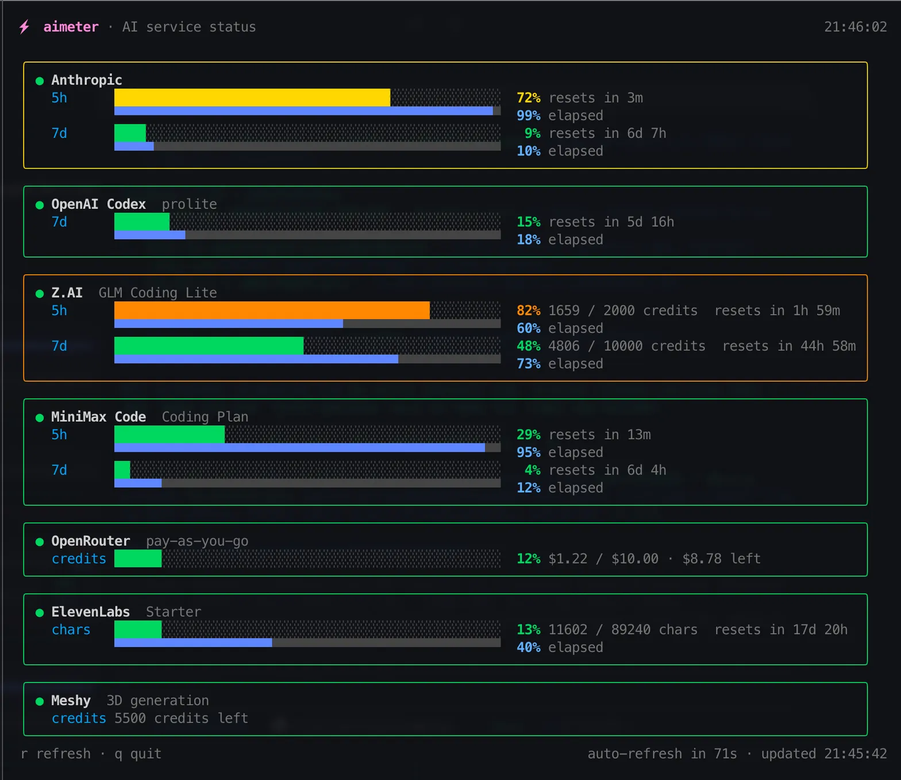
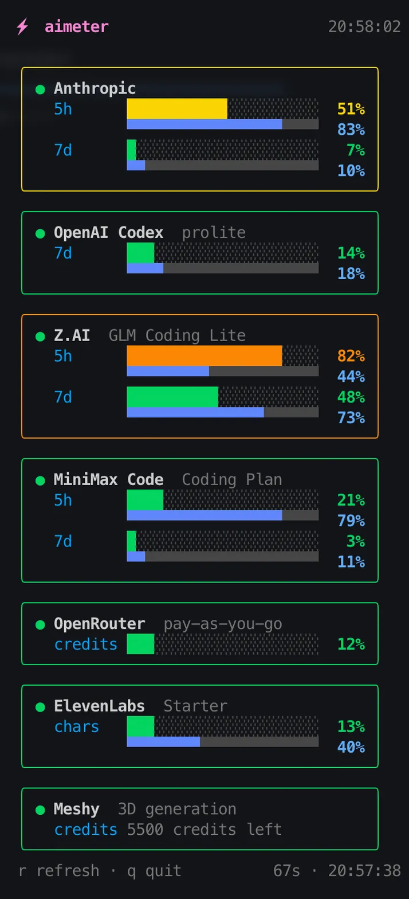

# aimeter

[](https://github.com/cookiebinary1/aimeter/actions/workflows/ci.yml)
[](https://pkg.go.dev/github.com/cookiebinary1/aimeter)
[](LICENSE)

TUI dashboard that surfaces API usage and quota gauges for a stack of AI
providers in one terminal view. Single static binary, no cgo, no runtime
dependencies.



## What it shows

Per-provider panels with current utilization, quota windows, and time-until-reset
for:

- Anthropic
- Codex
- Z.ai
- MiniMax
- OpenRouter
- ElevenLabs
- Meshy

Refresh interval is 90 seconds.

## Stack

- Go 1.25 (module `github.com/cookiebinary1/aimeter`)
- [Bubble Tea](https://github.com/charmbracelet/bubbletea) — TUI runtime
- [Lip Gloss](https://github.com/charmbracelet/lipgloss) — styling
- [modernc.org/sqlite](https://pkg.go.dev/modernc.org/sqlite) — pure-Go SQLite
  reader for the OMP credentials database

## Install

```sh
brew install cookiebinary1/tap/aimeter
# or, with a Go toolchain:
go install github.com/cookiebinary1/aimeter@latest
```

### Shell installer (macOS / Linux)

Install the latest release without Homebrew or a Go toolchain:

```sh
curl -fsSL https://raw.githubusercontent.com/cookiebinary1/aimeter/main/install.sh | sh
```

The installer detects amd64/arm64, downloads the matching GitHub Release,
verifies its SHA-256 against `checksums.txt`, and installs to `~/.local/bin`.
It requires `curl`, `tar`, and either `sha256sum` or `shasum`. It does not use
sudo or modify your shell configuration. Add `~/.local/bin` to your PATH if
needed, then run `aimeter`. Rerun the installer to update.

To inspect the script first, pin a release, or choose another directory:

```sh
curl -fsSL https://raw.githubusercontent.com/cookiebinary1/aimeter/main/install.sh -o install.sh
less install.sh
AIMETER_VERSION=v0.1.1 AIMETER_INSTALL_DIR="$HOME/.local/bin" sh install.sh
```

If the download or verification fails, your existing binary is left in place.
See [install.sh](install.sh) for the implementation.

### Windows

With Go 1.25 or later installed, run in PowerShell or Command Prompt:

```sh
go install github.com/cookiebinary1/aimeter@latest
```

Make sure the Go binary directory (normally `%USERPROFILE%\go\bin`) is on
PATH. Without Go, download the Windows amd64 or arm64 ZIP from
[GitHub Releases](https://github.com/cookiebinary1/aimeter/releases), extract
it, and run `.\aimeter.exe` from that folder in PowerShell. The shell installer
above is for macOS/Linux, not native Windows.

### Build from source

Or build from a checkout:

```sh
git clone https://github.com/cookiebinary1/aimeter
cd aimeter
go build -o ~/.local/bin/aimeter .
```

Builds and runs on macOS, Linux and Windows (amd64 and arm64).

The TUI is width-aware: every bar in the frame shares one width and one start
column, so the panels line up vertically whatever a single row's caption says.
A wide terminal spends the extra columns on the bars (up to a 220-column
frame); a narrow one drops the grey detail/reset captions and grows the bars to
fill the row instead of wrapping.



### Usage

```sh
aimeter              # TUI dashboard (q quit, r refresh, auto-refresh 90s)
aimeter -once        # render the dashboard once, no TUI
aimeter -plain       # Markdown table — for scripts, logs and agents
aimeter -json        # machine-readable JSON — for programs
aimeter -show-creds  # which source each credential resolved from
aimeter -version     # version string
```

If `aimeter` is run with no flags but **without an interactive terminal**
(piped stdout/stdin, CI, cron, deployment scripts), it auto-detects this and
behaves as `-plain` — the same data, log-friendly. Explicit flags always
override.

### `-plain`: Markdown table

```text
| Provider     | Plan            | Window  | Used | Detail                      | Resets in |
| ------------ | --------------- | ------- | ---- | --------------------------- | --------- |
| Anthropic    |                 | 5h      | 56%  |                             | 46m       |
| Anthropic    |                 | 7d      | 7%   |                             | 6d 7h     |
| OpenAI Codex | prolite         | 7d      | 14%  |                             | 5d 17h    |
| Z.AI         | GLM Coding Lite | 5h      | 82%  | 1659 / 2000 credits         | 2h 42m    |
| Z.AI         | GLM Coding Lite | 7d      | 48%  | 4806 / 10000 credits        | 45h 41m   |
| MiniMax Code | Coding Plan     | 5h      | 21%  |                             | 56m       |
| MiniMax Code | Coding Plan     | 7d      | 3%   |                             | 6d 4h     |
| OpenRouter   | pay-as-you-go   | credits | 12%  | $1.22 / $10.00 · $8.78 left |           |
| ElevenLabs   | Starter         | chars   | 13%  | 11602 / 89240 chars         | 17d 21h   |
| Meshy        | 3D generation   | credits |      | 5500 credits left           |           |
```

The columns are fixed (`Provider`, `Plan`, `Window`, `Used`, `Detail`,
`Resets in`), so the output is stable to parse by column index, renders as a
real table when pasted into an issue, PR or chat, and stays readable as plain
text in a log. Balance-only services leave `Used` empty; a failed provider
puts its message in `Detail`. Pipes inside values are escaped.

### Automation and AI agents

Both machine modes are built for feeding other tools: a coding agent, a cron
job or a deployment step can run aimeter and branch on real numbers instead of
guessing whether a quota is about to run out.

Give an agent the table directly — it needs no parsing instructions, because
the header explains every column:

```sh
aimeter -plain | llm "Which provider is closest to its limit, and how long \
until it resets? Answer in one sentence."
```

Gate work on remaining quota before starting an expensive run:

```sh
# Refuse to start if the 5h Anthropic window is above 90%
used=$(aimeter -json | jq -r '.[] | select(.provider=="Anthropic")
                              | .gauges[] | select(.label=="5h") | .used')
if (( ${used%.*} > 90 )); then
  echo "Anthropic 5h window at ${used}% — deferring the batch job"
  exit 1
fi
```

Fail a healthcheck when any provider errors, e.g. after rotating a key:

```sh
aimeter -json | jq -e '[.[] | select(.error != null)] | length == 0' > /dev/null \
  || { echo "a provider failed to report"; exit 1; }
```

Post the current state to Slack every morning from cron — the Markdown table
renders as-is:

```sh
0 9 * * * aimeter -plain | slack-post '#ops'
```

`-json` gauge fields: `label`, `used` (0-100, or -1 for balance-only),
`detail`, `resets_at` (RFC 3339), `resets_in`, `window`. A failed provider
carries an `error` field instead of gauges.

## Configuration

No credentials live inside the app. Each provider resolves through a chain of
non-invasive, read-only sources — first hit wins:

| Priority | Source | Notes |
| --- | --- | --- |
| 1 | Environment | `ZAI_API_KEY`, `MINIMAX_API_KEY`, `OPENROUTER_API_KEY`, `ELEVENLABS_API_KEY`, `MESHY_API_KEY` |
| 2 | `~/.config/aimeter/credentials.json` | JSON schema below; keep it `chmod 600` |
| 3 | macOS Keychain | `security find-generic-password -s aimeter -a <provider>` |
| 4 | OMP agent.db | only in `-tags omp` builds (personal-machine heuristics) |

OAuth providers rotate their tokens, so they prefer live sources over frozen
copies:

- **Anthropic**: config → OMP db (`-tags omp`) → Claude Code's own storage
  (macOS keychain entry, or `~/.claude/.credentials.json`)
- **Codex**: config → `~/.codex/auth.json` (Codex CLI's own file)

Anthropic usage responses are cached for five minutes. If Anthropic returns
HTTP 429, aimeter respects `Retry-After` across restarts and shows recent cached
usage for up to two hours, marked with its age. Without recent data, it shows
the time until the next attempt. The cache lives in the OS user cache directory.

`aimeter -show-creds` prints which source each provider resolved from — never
the key values themselves.

### credentials.json

```json
{
  "zai":        { "api_key": "..." },
  "minimax":    { "api_key": "..." },
  "openrouter": { "api_key": "..." },
  "elevenlabs": { "api_key": "..." },
  "meshy":      { "api_key": "..." },
  "anthropic":  { "access_token": "...", "email": "..." },
  "codex":      { "access_token": "...", "account_id": "..." },
  "custom": [
    {
      "name": "MyAI",
      "url": "https://api.myai.example/usage",
      "api_key": "sk-...",
      "label": "monthly",
      "used": "/data/used",
      "total": "/data/quota",
      "detail": "/data/plan"
    }
  ]
}
```

Every field is optional — provide only the providers you use. Group/world
readable permissions produce a warning at startup.

### Service costs

Panel headers show costs when there is enough room. Recognized Codex Plus
uses `~$20/mo list` (USD list price, verified 2026-10-07, not your invoice).
OpenRouter shows `usage-based`. Other plans show `cost unknown` because usage
APIs do not reliably identify their subscription price.

Set your actual payments in a top-level `costs` object in `credentials.json`:

```json
{
  "costs": {
    "anthropic": "€100/mo",
    "codex": "€23/mo",
    "zai": "$3/mo annual",
    "minimax": "$10/mo",
    "elevenlabs": "$5/mo",
    "meshy": "free"
  }
}
```

These are examples, not inferred payments. Supported keys are the provider
IDs above, `openrouter`, and `custom:<name>`. An empty string hides a cost.
Overrides take priority over list prices. JSON includes an additive `cost`
field; plain output includes the cost in the existing Plan column.
Credentials and costs are reread on every TUI refresh so OAuth token rotation
by Claude Code or Codex does not require restarting aimeter. Explicit token
copies in credentials.json still take priority and must be kept current.

### Expired Anthropic sessions

In the interactive dashboard, an explicit expired-token response from Anthropic
opens a confirmation prompt. Press `y` to renew the token, or `n`, Enter or Esc
to decline. Declining suppresses the prompt for that token for the current run.
Close Claude Code before confirming: renewal changes its credentials and a
concurrent renewal may invalidate its login. Aimeter re-reads credentials before
the request and before saving, but cannot eliminate races with Claude Code.

Renewal is supported for Claude Code's macOS Keychain entry and credentials file.
It preserves unrelated metadata and saves both rotated tokens and expiry.
Copied tokens in aimeter's configuration and OMP credentials are not renewed.
Non-interactive modes (`-once`, JSON and plain output) never renew tokens.
A failed renewal requires opening Claude Code and logging in again.

### Anthropic request frequency

Anthropic usage requests are limited to one attempt every 15 minutes on this
machine. The next allowed request time is saved in the OS cache directory, so
restarting aimeter, pressing `r`, running multiple instances or rotating an OAuth
token does not bypass the cooldown. Failed requests also start the cooldown.
An HTTP 429 extends it when `Retry-After` specifies a longer wait.

During the wait, aimeter displays cached usage with its age. Data older than two
hours is hidden. If no cached data exists, it displays the remaining wait.
This applies to interactive, one-shot, plain and JSON modes. Other providers keep
their existing refresh frequency. If the cooldown cannot be saved, aimeter skips
the Anthropic request rather than making an unthrottled request.

### Custom providers

For services aimeter does not know, add a `custom` entry: aimeter sends one
`GET` with an `Authorization: Bearer <api_key>` header and extracts values by
[RFC 6901 JSON pointer](https://datatracker.ietf.org/doc/html/rfc6901):

- `percent` — pointer to a 0-100 number, **or**
- `used` + `total` — pointers whose ratio becomes the percentage
- `label` (gauge caption, default `usage`), `detail` (extra text line) — optional

```json
{ "name": "MyAI", "url": "https://api.myai.example/usage", "api_key": "sk-...",
  "percent": "/data/usage_percent", "detail": "/data/plan_name" }
```

The gauge renders even without a reset window; entries missing `name` or `url`
are skipped with a warning.

## Security

By default aimeter reads credentials and sends each key only to that provider's
API over HTTPS. The interactive Anthropic renewal prompt is the sole exception:
after explicit confirmation, it sends the refresh token to Anthropic's OAuth
endpoint and updates Claude Code's existing credential storage. Tokens are never
printed or passed as subprocess command-line arguments.
It writes Anthropic usage, request cooldowns and retry times to a local cache,
but never the token.
It has no telemetry, and `-show-creds` deliberately prints sources without
values. `credentials.json` should be `chmod 600`; aimeter warns when it is
group- or world-readable.

## Project structure

```
.
├── main.go                 # provider fetchers + Bubble Tea UI
├── credentials.go          # credential chain (env → config → keychain)
├── credentials_omp.go      # OMP agent.db fallbacks (build tag: omp)
├── credentials_default.go  # no-op stub for default builds
├── custom.go               # user-defined providers (JSON pointer extraction)
├── output.go               # -plain and -json renderers
├── install.sh              # checksum-verified macOS/Linux release installer
├── tests/test_install.py   # offline installer regression tests
├── *_test.go               # resolver, custom, output and layout tests
├── go.mod
├── go.sum
└── LICENSE
```

## Contributing

Pull requests welcome — see [CONTRIBUTING.md](./CONTRIBUTING.md) for the
build/test commands CI enforces and how to add a provider. Many services need
no code at all: describe them as a [custom provider](#custom-providers).

## License

MIT — see [LICENSE](./LICENSE).
